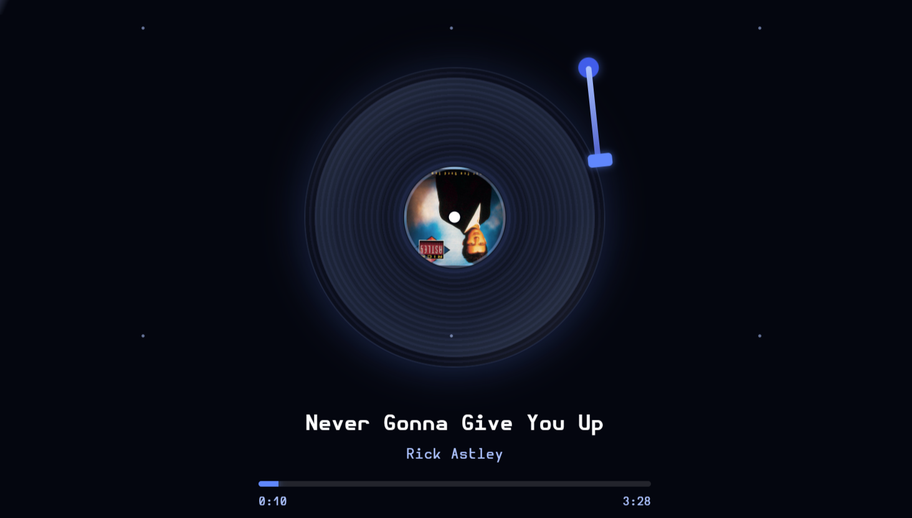

# Vinyl Visualizer

A Spicetify custom app that shows the currently playing track as a spinning vinyl record. The album art sits in the center label, and a tonearm drops and lifts as you play and pause.



## Features
- Spinning record with album art as the label
- Tonearm animation that follows play/pause
- Progress bar and track info
- Matches your Spicetify theme colors, with a blue fallback palette


## Install

**Requirements:** [Spicetify](https://spicetify.app) installed and working with the Spotify desktop app.

1. Open your Spicetify **CustomApps** folder:
   - **Windows:** `%appdata%\spicetify\CustomApps`
   - **macOS / Linux:** `~/.config/spicetify/CustomApps`

2. Copy the whole `vinyl-visualizer` folder into it (or `git clone` this repo there).

3. Open PowerShell (or your terminal) and run:
```bash
   spicetify config custom_apps vinyl-visualizer
   spicetify apply
```
   If this is your first time using Spicetify, run `spicetify backup apply` instead of `spicetify apply`.

4. Restart Spotify. A record icon appears in the left sidebar. Click it to open the Vinyl Visualizer.

## Uninstall

```bash
spicetify config custom_apps vinyl-visualizer-
spicetify apply
```
Then delete the `vinyl-visualizer` folder from `CustomApps`.
